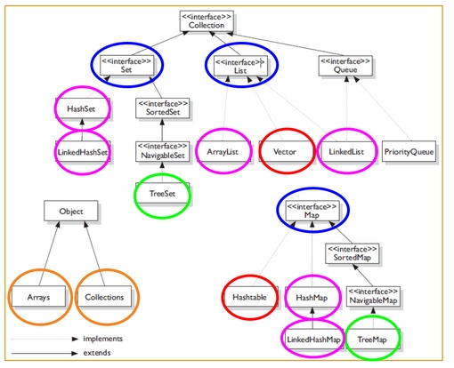
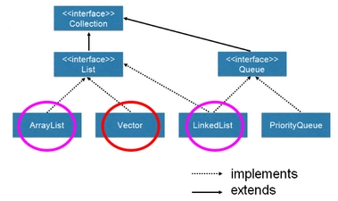
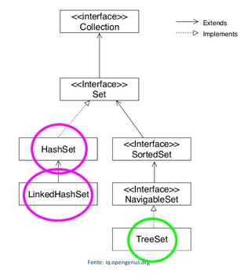
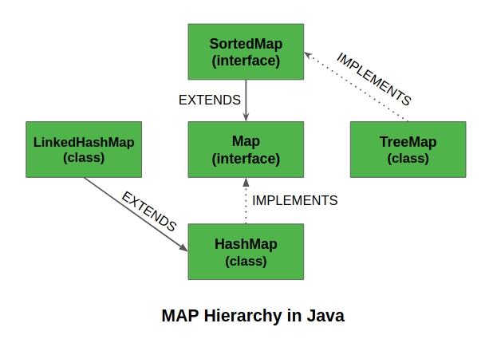
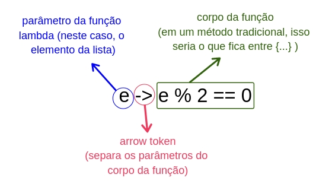

# === Collection ===

- e um objeto que agrupa múltiplos elementos (variáveis primitivas ou objetos) dentro de uma única unidade.
- Serve para armazenar e processar conjuntos de dados de forma eficiente
- após o java 2 (JDK 1.2) tem organização de um framework

## Composição da colection

- `Interfaces`: é um contrato que quando assumido por uma classe deve ser implementado
- `Implementações ou Classes`: são as materializações, a codificação das interfaces.
- `Algoritmos`: é a sequencia lõgica, finita e definida de instruções que devem ser seguidas para resolver um problema.

# == Interface List ==

- As listas são derivadas da interface java.util.List
- estende a interface Collection.
- o primeiro elemento de qualquer lista tem índice 0 (zero)
- permitem elementos duplicados (iguais) ou null
- possui o iterator ListIterator, que permite o início da iteração em qualquer ponto da lista,

## implementa

- AbstractList,
- AbstractSequentialList,
- `ArrayList`: deve ser usado onde mais operações de pesquisa são necessários.
- AttributeList,
- CopyOnWriteArrayList,
- `LinkedList`: deve ser utilizado onde mais operações de inserção e exclusão são nescessários.
- RoleList,
- RoleUnresolvedList,
- Stack,
- `Vector`:
  

---

# == Interface Set ==

- extends Collection
- aceita apenas valores únicos. Nenhuma das implementações da interface Set são thread-safe.

## Diferenças entre: HashSet, LinkedHashSet e TreeSet

### HashSet: implementa a interface “Set”, temos os mesmos métodos.

=> é o mais rápido de todos
=> usa algorítimo HashTable e seus elementos não são ordenados (embaralha),
=> sem se importar com a ordem com que os elementos estão ordenados.
=> a complexidade é O(1)

### TreeSet: implementa a interface “Set”, temos os mesmos métodos.

=> implemente o algoritmo red-black tree (árvore rubro-negra)
=> é o único Set que implementa a interface SortedSet em vez de Set diretamente,
=> possui elementos ordenados automaticamente,
=> oferece mais métodos como: first(), last(), headSet(), tailSet(),
=> Ordenação: Temos que implementar a interface Comparable, que obrigatoriamente nos fara implementar o método “compareTo”.
=> a complexidade é O(log (n))

### LinkedHashSet: implementa a interface “Set”, temos os mesmos métodos.

=> um pouco da performance do HashSet e um pouco do poder de ordenação do TreeSet,
=> faz uso também do HashTable mas os elementos continuam na ordem que são inseridos,
=> a complexidade é O(1)

---

# == Interface Map ==

- Essa interface é um objeto que mapeia valores para chaves,
- a chave não pode ser repetida ao contrário do valor,
- não possui métodos da interface Collection,
- São perfeitos para usar no mapeamento de associação de valores-chave, como dicionários.
- São usados ​​para realizar pesquisas por chaves ou quando alguém deseja recuperar e atualizar elementos por chaves.

## implementa

- Existem duas interfaces para implementar Map em java.
- Eles são, Map e SortedMap,
- três classes: HashMap, TreeMap e LinkedHashMap.
- não pode conter chaves duplicadas e cada chave pode ser mapeada para no máximo um valor.
- Algumas implementações permitem chave nula e valor nulo como o HashMap e LinkedHashMap , mas algumas não gostam do TreeMap,
- A ordem depende das implementações específicas.
- TreeMap e LinkedHashMap têm ordem previsível, enquanto o HashMap não tewm.

## Classe HashMap

- é a implementação da interface Map mais trabalhada no campo de desenvolvimento,
- Os elementos não são ordenados; É rápida na busca/inserção de dados; Permite inserir valore e chaves nulas;
- a complexidade é O(1)

### Métodos úteis

- values() - É uma Collection com todos os valores que foram associados a alguma das chaves.
- keySet() - Retorna um Set com as chaves do mapa especificado
- entrySet() - Retorna um conjunto de Maps contido no mapa configurado, podendo ser possível acessar suas chaves e valores.
- put(Key key, Value value) - Associa um valor a uma chave específica.

---

# Java Streams API

- A Streams API traz uma nova opção para a manipulação de coleções em Java seguindo os princípios da programação funcional.
- Combinada com as expressões lambda, ela proporciona uma forma diferente de lidar com conjuntos de elementos, oferecendo ao desenvolvedor uma maneira simples e concisa de escrever código que resulta em facilidade de manutenção e paralelização sem efeitos indesejados em tempo de execução.

## manipulando coleções de forma eficiente

## Classe anônima

- Não recebeu um nome e é tanto declarado e instanciado em uma única instrução.
- Considere criar uma classe anônima quando voce instaciará uma única vez.
- É uma classe interna sem um nome e para a qual apenas um único objeto é criado.
- Uma classe interna anônima pode ser útil ao criar uma instância de um objeto com certos “extras”, como métodos de sobrecarga de uma classe ou interface, sem ter de realmente criar uma subclasse de uma classe.
- criadas principalmente de duas maneiras:
  - Classe (pode ser abstrata ou concreta)
  - Interface

### Tipos de classes internas anônimas:

- Classe interna anônima que estende uma classe;
- Classe interna anônima que implementa uma interface;
- Classe interna anônima que define o argumento do método / construtor interno;
- a classe interna anônima pode implementar apenas uma interface por vez
- a classe Interna anônima pode estender uma classe ou pode implementar uma interface, mas não as duas ao mesmo tempo;
- não podemos escrever nenhum construtor para a classe Interna anônima.

## Functional Interfaces

- são todas as interfaces que possuem um método à ser implementados (um método abstrato).(SAM).
- Single Abstract Method (SAN)
- Sua implementação pode se tratada como uma expressão lambda.
- anotação: @FunctionalInterface

### Tipos de interfaces

- Comparator
- Consumer
- Function
- Predicate

## Lambda

- É uma função sem declaração, não necessita de um nome, um tipo de retorno e um modificador de acesso.
- Ser declarada no mesmo lugar em que será usada.
- sintaxe: (argumento) -> (corpo)

# method reference

## sintax:

- Lambda: (Gato gato) -> gato.getNome());
- Method Reference: Gato::get.Nome);
- nem sempre é possível substituir um lambda por um method reference.
- É necessário que a invocação de método da direita receba os mesmos parâmetros da esquerda do lambda
